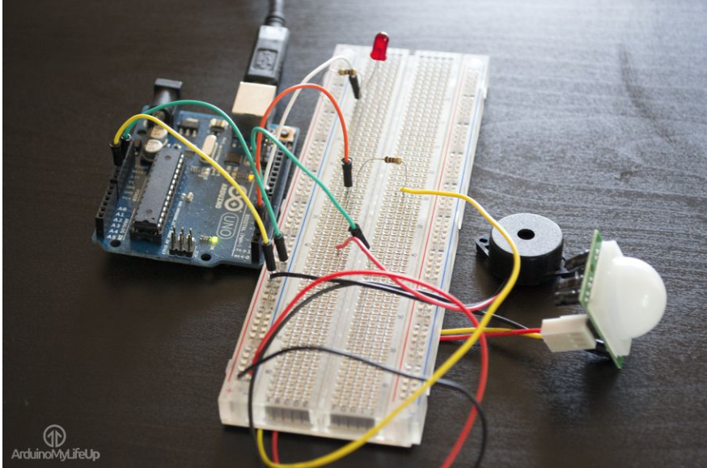

# Elevator Icebreaker
> Everyone has experienced an awkward elevator ride. You're standing so close to a bunch of strangers and you don't know where to look or what to say. This is why we have created the Elevator Icebreaker. 


The idea is to add some fun and excitement to a mundane moment of the day. A motion sensor detects when someone enters the elevator, the lights turn on with a light display and the sound comes on.



## Features

- [x] Motion Sensor 
- [x] Music from Speakers/Headphones
- [x] LED display


## Requirements

- ARDUINO 1.8.5 code editor
- TMRpcm 1.0.0 library
- Adafruit_NeoPixel library

## Installation
You can install Arduino code editor [Arduino.cc](https://www.arduino.cc/en/Main/Software).
TMRpcm 1.0.0 library can be downloaded from[Github](https://github.com/TMRh20/TMRpcm).
Adafruit_NeoPixel library can be downloaded from[Adafruit](https://learn.adafruit.com/adafruit-neopixel-uberguide/software). 


```
#### Manually install libraries
1. Download and drop  your libraries into the ```Library``` folder in your Arduino folder.  
2. Congratulations!  

## Adding the code
Add the code to your Arduino code editor in a new sketch and upload it to the prototype.

## Usage example
To check if the code works, make a motion in front of the motion sensor and the lights should light up and the sound plays.


## Meta

Max Lindroos
Tove Swenson
Fiona Okafor


